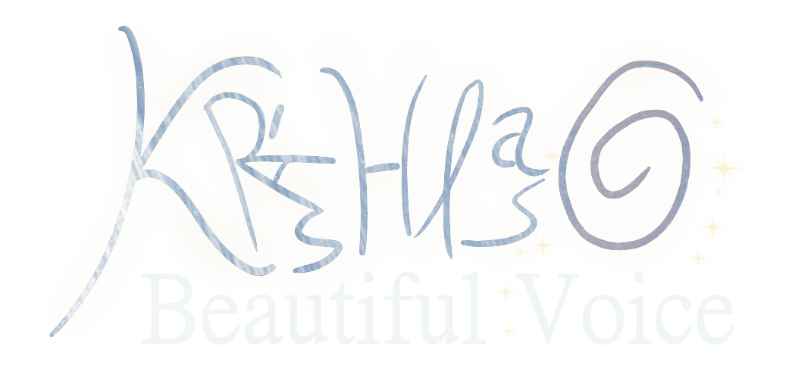

### Kráshlas - Beautiful Voice
## For all your Czech Vocaloid needs. 
Based off of Vocaloid, made specifically to be more compatible for Czech and general Slavic phonetics via crossfading sounds, allowing for long consonants such as in words like "zmrzlina". 
Pronounced kras-HLAS, from Czech word "krásný" meaning beautiful and "hlas" meaning "voice"

## How It Works


Eventually I want to make it Midi compatible but for now my goal is essential, "O kurva! Česka Teto".

## Requirements
[scikit-maad](https://scikit-maad.github.io/install.html) for audio editing.

```pip install scikit-maad```

## Music Formatting

```"Info" = {
    "Title" = "Čaj",
     "Author" = "MajorBulletMagnet (@MajorCodingMistakesWereMade)",
    "ReleaseDate" = "11.8.2025",
}

"Song" = {
    {
            "Coordinates" = { -- start and end point
                "Start" = {
                    "X" = 0,
                    "Y" = 0,
                }
                "End" = {
                    "X" = 2, -- beats
                    "Y" = 0, -- octave
                }
                "CurveIntensity" = 0.5 -- easing style
            }.
            "Sound" = "čaj" -- interpolated into a sound the č starting and middle sound are used, so is the entirre a sound and the middle and ending j sound.

    },
    {
            "Coordinates" = {
                "Start" = {
                    "X" = 3,
                    "Y" = 3,
                }
                "End" = {
                    "X" = 4,
                    "Y" = 2,
                }
                "CurveIntensity" = 0.5
            }.
            "Sound" = "čaj"

    },     
}
```